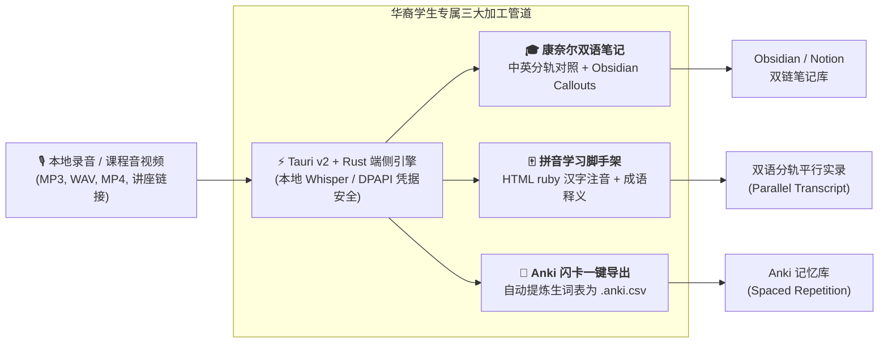

# HeritageScribe (声华笔记) · v2.1

> **A Local-First, Privacy-Preserving Bilingual Lecture & Oral History Transcriber for Asian-American Heritage Students**  
> *面向美国华裔大学生的本地端侧双语课程转写与代际口述历史数字化工作台 (v2.1 Daily Scaffolding Edition)*

[](CHANGELOG.md)
[](https://v2.tauri.app/)
[](https://www.rust-lang.org/)
[](https://vuejs.org/)
[](https://obsidian.md/)
[](https://apps.ankiweb.net/)
[](#privacy--security-guarantee)
[](LICENSE)

---

## 📖 1. 立项背景与解决的问题 (Why We Built HeritageScribe)

### 华裔大学生的现实痛点 (The Heritage Learner Dilemma)
在全美各大高校（如 Stanford、Berkeley、UCLA 等），数以万计的华裔第二代（Heritage Speakers / ABC）选修了中文、东亚研究、跨文化历史课程，或积极参与双语学术研讨会。他们往往拥有**敏锐的中文听说听感（Auditory Fluency），但面对繁杂的汉字书写与专业学术术语时存在明显的阅读时差**，在听讲座时极难实时完成英文/双语学术笔记。

### 逐渐消逝的第一代声音 (Preserving Generational Voices)
与此同时，许多华裔青年渴望采访年迈的长辈、父母或唐人街社区先辈，记录下第一代移民白手起家、跨洋求索的家庭口述历史（Oral History）。然而：
1. **语码转换摩擦（Code-Switching & Dialects）**：长辈讲述时常中英文夹杂、带有台山/福州/粤语等口音，普通商用转写软件识别极易乱码；
2. **云端隐私顾虑与高昂订阅费**：Otter.ai、Notta 等商业 SaaS 工具按月高昂收费，更关键的是，**长辈的家庭经历与家族隐私绝不应上传至云端商业大模型进行无控训练**；
3. **缺乏学术与语言学习闭环**：传统转写软件仅仅吐出大段杂乱文本，缺少拼音脚手架（Pinyin Scaffolding）、康奈尔双语笔记结构（Cornell Notes）以及 Anki 闪卡沉淀。

**HeritageScribe (声华笔记)** 应运而生。它从 Michael 早期自学的 `video2md` 极客原型演进而来，采用 **Tauri v2 + Rust 系统级轻量架构**，打造了一款**100% 本地端侧运行、零泄密、免费开源的华裔双语学术与口述历史数字化利器**。

---

## ✨ 2. v2.0 核心能力与功能亮点 (Key Features in v2.0)



### 🎓 1. 华裔双语课程 Cornell 笔记 (Cornell Academic Notes)
* 自动生成适配 **Obsidian Callouts**（`> [!NOTE]`）的双语康奈尔学术笔记模板。
* **左栏线索栏 (Cue Questions)**：提取讲座核心论题与学术概念；
* **右栏笔记栏 (Notes Column)**：中英双向重点对照，保留关键原文；
* **文末总结栏 (Summary & Review Questions)**：提炼 3 点跨文化反思思考题。

### 🀄 2. 华裔语言学习脚手架 (Heritage Scaffolding Engine)
* **汉字拼音注音高亮**：对重要生词、历史专有名词使用 HTML `<ruby>传承<rt>chuán chéng</rt></ruby>` 优雅注音，在 Obsidian 与浏览器中悬浮展示拼音，彻底扫清识字障碍。
* **双语分轨对照（Parallel Bilingual Tracks）**：中文原文与地道英译逐句对齐，点击时间戳随时回溯音频定位。

### 📇 3. Anki 闪卡卡片包一键导出 (One-Click Anki Deck Export)
* 自动扫描转写与整理结果，智能提取讲座与访谈中出现的成语（Idioms）、文化专有名词、学术术语。
* 结果页面一键生成并下载标准格式的 `*_Anki.tsv` 或 `*_Anki.csv`，支持直接批量导入 **Anki** 进行间隔重复记忆复习。

### 🔍 4. v2.1 学习日常深化特性 (v2.1 Daily Scaffolding Highlights)
* **讲座长文内快速检索与高亮**：针对 1-2 小时超长讲座或口述历史实录，支持文内实时关键词搜索与匹配计数；
* **80+ 华裔文史核心字典**：内置排华法案、天使岛、侨乡会馆、宗族家谱、典故考据等高频词拼音映射；
* **四重视图随心切换**：标准 Markdown、拼音注音、双语对齐、考前核心要点，一键即时无缝切换；
* **东亚文史研讨专属预设**：专攻大学古籍文史精读与双语研讨，自动对齐学术争鸣。

### 🎙️ 5. 长辈口述历史与家族大事年表 (Oral History & Timeline)
* 专为第一代移民口述设计：
  * 保留“金山客”、“同乡会”、“餐馆生计”等特定移民文化原词，加注英文社会历史注解；
  * 自动提炼长辈一生的地理迁移与时代事件，生成结构化**家族/社区大事年表（Milestone Timeline）**；
  * 提炼长辈对后代的精神嘱托（Legacy & Resilience）。

### 🔒 6. 100% 端侧隐私与零运行成本 (Local-First Privacy & Zero Cloud Leak)
* 架构完全采用 **Local-First（端侧优先）** 原则：
  * 录音文件全程存放在学生本机内存与本地磁盘中，零中转、零上传；
  * 本地 API 密钥通过 **Windows DPAPI** 系统级硬件加密，保障个人敏感配置绝对安全；
  * 软件体积仅数兆字节，内存占用不到传统 Electron 应用的 20%。

---

## 🏛️ 3. 系统技术架构 (Architecture Overview)

HeritageScribe 采用现代化的系统级桌面端架构，实现跨平台高性能与极致能效比：

```
HeritageScribe/
├── src/                          # Vue 3 + TypeScript 前端展现层
│   ├── components/               # 视图组件
│   │   ├── TopBar.vue            # 品牌顶栏、Heritage Edition 标识、本地隐私指示
│   │   ├── ConvertView.vue       # 华裔双语场景预设、格式配置、转换队列
│   │   ├── ResultsView.vue       # 知识成果库、双语注音预览、Anki/Obsidian 导出
│   │   ├── PrepareView.vue       # 批量多模态音视频素材导入与校验
│   │   └── SettingsView.vue      # 端侧转写引擎配置 (Whisper/Gemini/Local)
│   ├── data/
│   │   └── promptTemplates.ts    # 华裔双语课程/口述历史/Anki提取提示词系统
│   ├── services/
│   │   ├── heritageScaffolding.ts# 拼音注音、Anki CSV 生成、Obsidian Callout 转换
│   │   └── tauri.ts              # Tauri v2 强类型 IPC 通信桥
│   └── stores/                   # Pinia 响应式状态管理 (Project, Task, UI)
├── src-tauri/                    # Rust 系统原生底层
│   ├── src/
│   │   ├── commands.rs           # 原生指令、Windows DPAPI 凭据保险箱、进程调度
│   │   ├── project.rs            # 项目元数据与结果产物生命周期管理
│   │   └── lib.rs / main.rs      # Tauri v2 应用生命周期
│   ├── Tools/                    # 端侧音频切片与大模型加工引擎
│   │   ├── transcribe.py         # 音频预处理、VAD 人声切片、多引擎转写调度
│   │   └── reorganize_documents.py# 双语结构化整理、Anki 词汇自动拆分输出
│   ├── Cargo.toml                # Rust 依赖 (Tauri 2, serde, DPAPI, rfd)
│   └── tauri.conf.json           # 应用配置、窗口属性、安全 CSP 策略
└── package.json                  # 前端工具链定义
```

---

## 🚀 4. 快速开始 (Getting Started)

### 环境要求 (Prerequisites)
* **Node.js** >= 18.0.0
* **pnpm** >= 9.0.0
* **Python** >= 3.10 (安装有 ffmpeg 依赖)
* **Rust & Cargo** (用于桌面端二进制编译)

### 本地开发 (Development)
```bash
# 1. 克隆仓库
git clone https://github.com/microsoftgame/video2md.git
cd video2md

# 2. 安装前端依赖
pnpm install

# 3. 启动开发模式 (Vite HMR 前端实时热重载)
pnpm run dev

# 4. 启动 Tauri 原生桌面开发模式
pnpm run tauri:dev
```

### 生产打包 (Production Build)
```bash
# 编译高度精简的 Windows 原生独立安装包 (.msi / .exe)
pnpm run tauri:build
```

---

## 🎓 5. 斯坦福申请与社会价值阐述 (Stanford Admissions & Community Alignment)

> *"The true test of engineering is whether technology brings warmth to human connections."*

在斯坦福大学 REA 早申（申请方向：**Electrical Engineering / Applied Mathematics**）的智识追求（Intellectual Vitality）与社区领导力考察中，`HeritageScribe` 提供了极具说服力的“工程能力 + 人文关怀”实证：

1. **从“通用工具”到“社区赋能”的认知跃迁**：
   Michael 没有停留于简单开发一个能跑的 Python/Tauri 脚本，而是敏锐洞察到了华裔青年面临的**“文化断层、长辈口述史失传、语言阅读壁垒”**三大社会痛点，用系统工程（System Engineering）提供了一套零成本、免隐私外泄的开箱即用方案。
2. **现代系统技术栈的驾驭力**：
   在短短数周内从 TypeScript 跨界自学 **Rust + Tauri v2 原生架构**，攻克进程间 IPC 高速流式传输与 Windows DPAPI 硬件加密，展现出对前沿现代系统工具极快的学习速度与工程审美。
3. **斯坦福人道主义科技价值观（Human-Centered Computing）**：
   完美呼应斯坦福 HAI（Human-Centered AI Institute）所倡导的理念：**科技的核心不是冷冰冰的模型参数竞赛，而是赋能具体的人，保护多元族裔的文化遗产与家庭记忆**。

---

## 📜 许可协议 (License)

本项目基于 [MIT License](LICENSE) 开源发布。欢迎广大华裔青年、高校东亚研究学者及开源社区共同贡献！
